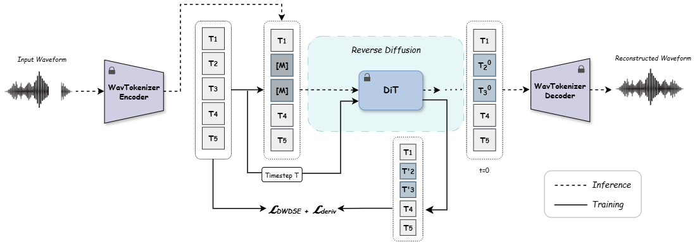

<h1 align="center">Token-Based Audio Inpainting via Discrete Diffusion (AIDD)</h1>

<p align="center">
  
</p>

<p align="center">
  <b>Tali Dror</b><sup>*</sup>,
  <b>Iftach Shoham</b><sup>*</sup>,
  <b>Moshe Buchris</b>,
  <b>Oren Gal</b>,
  <b>Haim Permuter</b>,
  <b>Gilad Katz</b>,
  <b>Eliya Nachmani</b>
  <br>
  <i>Ben-Gurion University of the Negev, University of Haifa</i>
</p>

<p align="center">
  <sup>*</sup>Equal contribution
</p>

<p align="center">
  <a href="https://arxiv.org/abs/2507.08333">
    
  </a>
  <a href="https://iclr.cc/">
    
  </a>
  <a href="https://huggingface.co/TaliDror/AIDD">
    
  </a>
  <a href="LICENSE">
    
  </a>
</p>

---

## Overview

This repository contains the official implementation of **AIDD – Audio Inpainting via Discrete Diffusion**, presented at **ICLR 2026**. AIDD performs audio inpainting by applying diffusion in a **discrete token space**, enabling semantically coherent reconstruction of missing audio segments, including long gaps of up to **750 ms**.

The method combines discrete audio tokenization using a pretrained **WavTokenizer**, a **DiT-style transformer** trained with the DWDSE objective, and inpainting-oriented training strategies including **span-based masking** and **derivative-based regularization**. At inference, masked regions are reconstructed via reverse diffusion and decoded back to waveform audio with smooth crossfading.

---

## News

- ✅ Paper accepted at **ICLR 2026**
- 🔜 Code and pretrained model weights released
- 🔜 Audio demos and project page

---

## Setup

### Requirements

```bash
git clone https://github.com/iftachShoham/AIDD.git
cd AIDD
conda env create -f environment.yml
conda activate aidd
```

### WavTokenizer Setup

Before running inference or training, clone [WavTokenizer](https://github.com/jishengpeng/WavTokenizer) into the project root and download its weights:

```bash
git clone https://github.com/jishengpeng/WavTokenizer.git tokenizer
```

Then download the pretrained checkpoint from the WavTokenizer repository and place it inside `tokenizer/`:

```
tokenizer/
├── configs/
│   └── wavtokenizer_mediumdata_frame75_3s_nq1_code4096_dim512_kmeans200_attn.yaml
├── tokenizer/
│   ├── decoder/
│   └── encoder/
└── wavtokenizer_medium_speech_320_24k.ckpt
```

---

## Inference

Run inference with `run_infer.py`, which creates gaps at evenly spaced positions, fills them with AIDD, and stitches the result with crossfading:

```bash
python run_infer.py \
    --input_dir ./test_audio \
    --output_dir ./results \
    --model_path path/to/checkpoint.pth \
    --gaps 500
```

| Argument | Description | Default |
|:---|:---|:---|
| `--input_dir` | Directory of input `.wav` files | Required |
| `--output_dir` | Directory for output files | Required |
| `--model_path` | Path to AIDD checkpoint | Required |
| `--gaps` | Gap length in milliseconds | `350` |
| `--num_gaps` | Number of evenly spaced gaps | `1` |
| `--steps` | Diffusion steps (higher = better quality) | `1024` |
| `--samples` | Number of inpaintings per file | `1` |
| `--device` | Device (`cuda` or `cpu`) | `cuda` |
| `--fade_len` | Crossfade length in samples | `100` |

**Output structure:**
```
output_dir/
├── masked_wavs/     # Audio with gaps zeroed out + gap_info.csv
├── orig_wavs/       # Resampled original audio (24kHz mono)
├── generated_wavs/  # Raw model output
└── stitched/        # Final inpainted audio with crossfade
```

---

## Training

### Data Preparation

Tokenize your audio data using WavTokenizer and update `configs/enums.py` with the paths to your tokenized `.pt` files.

Set the Hydra output directory in `configs/config.yaml`:

```yaml
hydra:
  run:
    dir: path/to/output/${data.dataset}/${now:%Y.%m.%d}/${now:%H%M%S}
```

### Run Training

```bash
python core/trainers/train.py
```

**Resume from checkpoint:**
```bash
python core/trainers/train.py load_dir=<path_to_experiment_dir>
```

**Override config values:**
```bash
python core/trainers/train.py model=medium training.batch_size=64 ngpus=2
```

Key parameters in `configs/config.yaml`:

| Parameter | Default | Description |
|:---|:---|:---|
| `training.span_train` | `True` | Enable span-based masking |
| `training.use_diff_loss` | `True` | Enable derivative regularization loss |
| `training.lamda` | `500.0` | Derivative loss weight |
| `training.p_base` | `0.8` | Base span masking probability |
| `training.alpha` | `0.5` | Span length noise-level scaling |
| `noise.type` | `loglinear` | Noise schedule |

**WandB logging:** set `wandb_entity` in your config or pass it as a Hydra override.

---

## Acknowledgments

This work is built upon prior works, including
[Discrete Diffusion Modeling by Estimating the Ratios of the Data Distribution](https://github.com/louaaron/Score-Entropy-Discrete-Diffusion.git)
and
[WavTokenizer: An Efficient Acoustic Discrete Codec Tokenizer for Audio Language Modeling](https://github.com/jishengpeng/WavTokenizer.git).
We are grateful to the authors for making their methods and code publicly available.

---

## Citation

If you find this work useful, please cite our paper:

```bibtex
@inproceedings{dror2026token,
  title={Token-based Audio Inpainting via Discrete Diffusion},
  author={Dror, Tali and Shoham, Iftach and Buchris, Moshe and Gal, Oren and Permuter, Haim and Katz, Gilad and Nachmani, Eliya},
  booktitle={International Conference on Learning Representations},
  year={2026}
}
```

---

## License

This project is licensed under the MIT License — see the [LICENSE](LICENSE) file for details.
